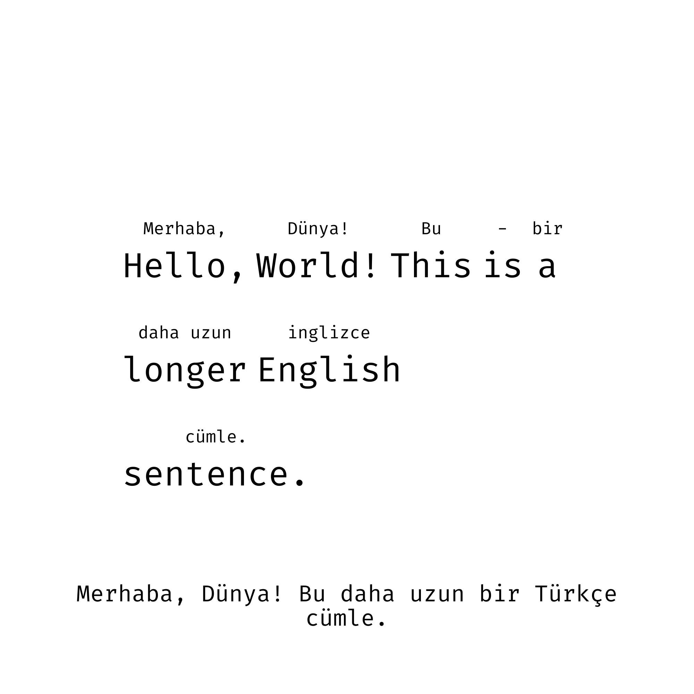

# Text-On-Image



This repository contains a Python script that generates an image with English and Turkish text using Python's PIL library. It calculates the dimensions and positions for each word, draws the text on the image, and saves it as a PNG file.

The main purpose of this project is for language learning by displaying the main sentence then above each word its corresponding translation, and the full translation.

## Getting Started

These instructions will get you a copy of the project up and running on your local machine for development and testing purposes.

### Prerequisites

What things you need to install the software and how to install them:

- Python 3.x
- PIL library

### Installing

A step by step series of examples that tell you how to get a development environment running:

1. Clone the repository to your local machine:
   ```
   git clone https://github.com/Albaraazain/Text-On-Image.git
   ```
2. Navigate to the project directory:
   ```
   cd Text-On-Image
   ```
3. Install the required libraries:
   ```
   pip install pillow
   ```
4. Run the script:
   ```
   python main.py
   ```

## Usage

Explain how to use the script, what input it needs and what output it generates.

## Contributing

Please read [CONTRIBUTING.md](https://github.com/Albaraazain/Text-On-Image/CONTRIBUTING.md) for details on our code of conduct, and the process for submitting pull requests to us.

## License

This project is licensed under the MIT License - see the [LICENSE.md](https://github.com/Albaraazain/Text-On-Image/LICENSE.md) file for details

## Acknowledgments

- Hat tip to anyone whose code was used
- Inspiration
- etc